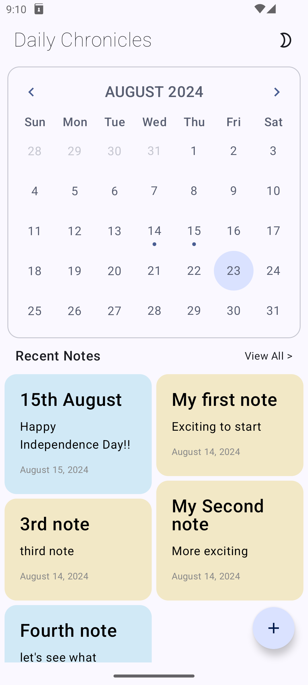
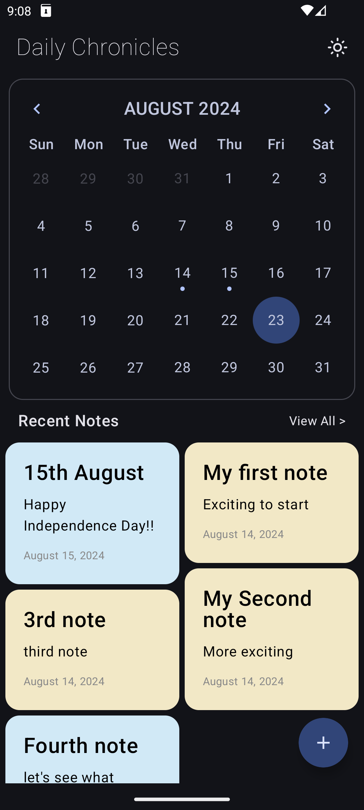
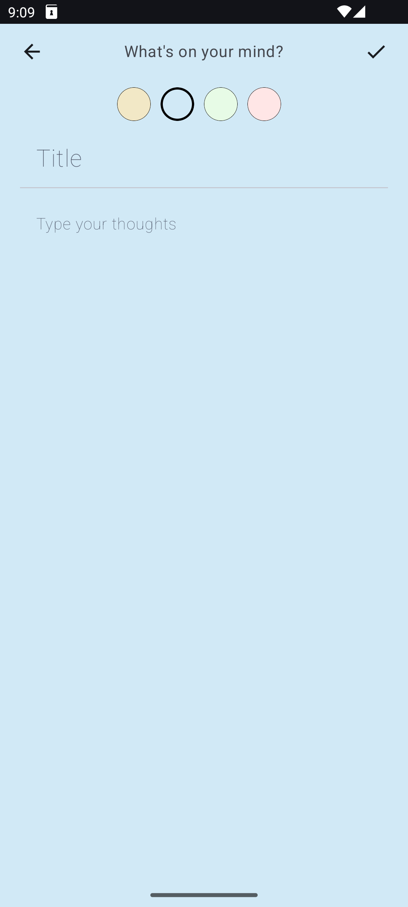
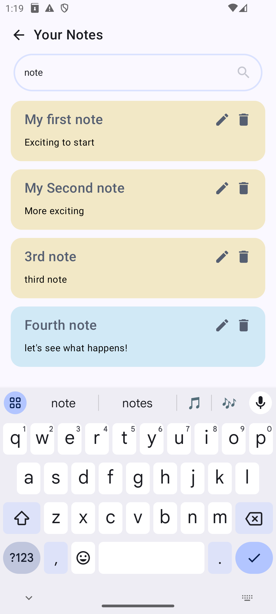
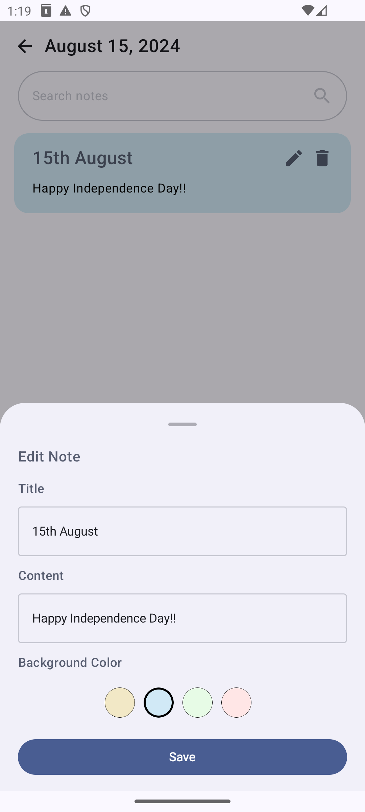
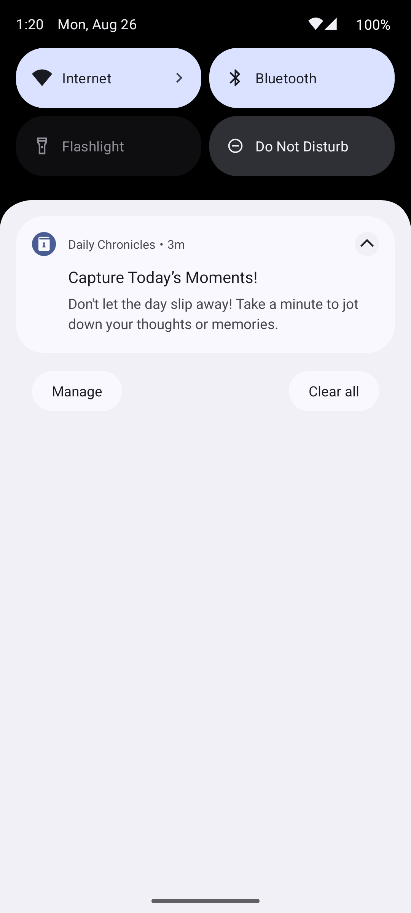

# Description

App name - **Daily Chronicles**

Daily Chronicles is an android app which you can use as your personal diary.

## Features

- Use calendar to pick a date and add note on that day.
- Add, edit, search and delete notes date-wise.
- Biometric authentication for security and privacy.
- Periodic notification reminder to jot down your thoughts and memories.
- Both light and dark mode support.

## Screenshots

| HOME_LIGHT                | HOME_DARK                | CREATE |
 ---------------------------|--------------------------|------------|
|  |  |  

| SEARCH                 | EDIT                 | NOTIFICATION
 ------------------------|----------------------|-------------|
|  |  | 

## Tech Stack

- Jetpack Compose for UI
- Androix-navigation (navigation-compose and hilt-navigation-compose) library for type-safe navigation
- MVVM (Model-View-ViewModel) architecture pattern
- Dagger-hilt for dependency injection
- Room database and Shared Preferences for local data storage
- WorkManager for periodic notifications
- Kotlin coroutines and flows for asynchronous operations and data handling

